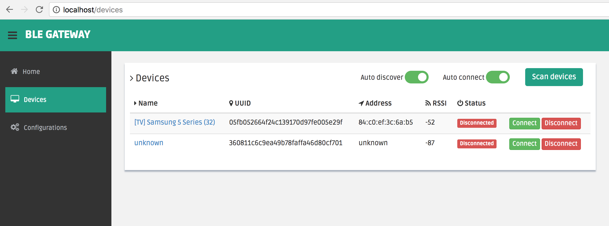
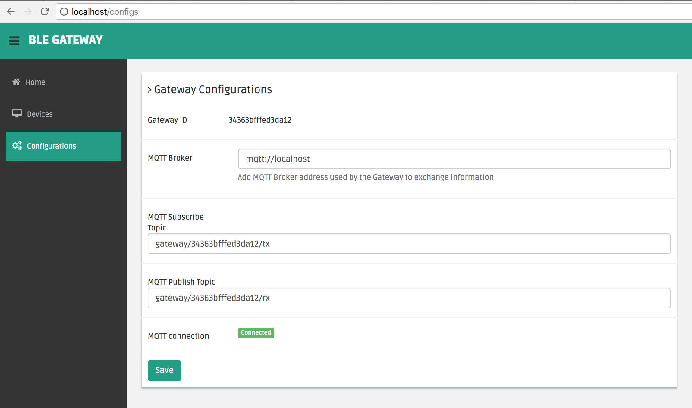

# BLE Gateway <-> MQTT

## About
The scope of this project is to build a stable Bluetooth Low Energy Gateway which exchange messages with a MQTT Broker. The advantage of exchanging messages with a MQTT Broker is that a bi-directional connection can be enabled between the Bluetooth sensors and the Network Server.

This BLE Gateway implements a nice looking and easily operated Web Application which allows the user to easily manage the Bluetooth sensors inside the network.

The current version of the BLE Gateway accepts only two characteristics per device: **notify** characteristic and **write** characteristic.

The **notify** characteristic is used by the BLE Gateway to read the data sent by the Bluetooth sensors and publish them on MQTT Broker.

The **write** characteristic is used to send the data received from MQTT Broker to the Bluetooth sensors.

Example of a Bluetooth sensor implementation: [BLE_write_read.ino](https://github.com/bogdanoniga/IoT/blob/master/code_snippets/ble/esp32/BLE_write_read/BLE_write_read.ino)


## Web Application

### Devices (/devices)
Features offered by **/devices**:
- Scan devices - discover bluetooth devices.
- Connect/Disconnect - connect or disconnect discovered bluetooth devices.
- Auto Discover - enable auto discover mode.
- Auto Connect - enable auto connect mode.

[](./public/img/gateway/devices.png)

### Configs (/configs)
Features offered by **/configs**:
- Gateway ID - unique identifier of the gateway (EUI64).
- MQTT Broker - set the MQTT Broker address on which the gateway is connecting.
- MQTT Subscribe/Publish Topics - define the MQTT Topics on which the gateway is listening and publish data.

[](./public/img/gateway/configs.png)


## API

**GET /api/discover** - start discover Bluetooth devices

**GET /api/devices** - get the list of devices discovered

**POST /api/connect** - connect a discovered device based on its **uuid**
- params: **uuid**

**POST /api/disconnect** - disconnect a device based on its **uuid**
- params: **uuid**

**POST /api/auto** - set **auto_discover**/**auto_connect** mode
- params:
  - **auto_discover** (true/false)
  - **auto_connect** (true/false)


## Methods
**readData()** - Read messages received from devices and publish them to MQTT Broker
```
function readData(data) {
  console.log(this._peripheralId, data.readIntLE());

  // message example
  var message = {
    "uuid": this._peripheralId,
    "payload": data.readIntLE()
  }

  // Publish to MQTT Broker
  mqtt_client.publish(topic_rx, Buffer.from(JSON.stringify(message)));
}
```

**sendData()** - MQTT on message listener which sends the payload received from MQTT Broker to devices
```
function sendData() {
  mqtt_client.on('message', function(topic, message) {
    /*
    message = {
      uuid: "ble_device_uuid",
      payload: "payload_from_server"
    }
    */

    /* Send to a specific target */
    let msg = JSON.parse(message.toString('utf-8'));
    var uuid = msg['uuid'];
    var payload = msg['payload'];

    sendMessage(uuid, payload);
  });
}
```

**sendMessage(uuid, payload)** - Sends the payload to the specified device (uuid)

**sendBroadcast(payload)** - Broadcasts the payload to all connected devices

**send message from MQTT Broker to Gateway**
```
mosquitto_pub -h localhost -t "gateway/<gateway_id>/tx" -m '{
    "uuid": "<uuid>",
    "payload": "<payload>"
}'
```


## Development

##### Install environment
**macOS**
```
brew install nodejs nginx
git clone https://github.com/bogdanoniga/ble_gateway.git
cd ./ble_gateway
npm install
mv ./nginx.conf /usr/local/etc/nginx/nginx.conf
```

**[Raspbian Stretch Lite (Raspberry Pi)](http://ftp.jaist.ac.jp/pub/raspberrypi/raspbian_lite/images/raspbian_lite-2018-03-14/)**
- Setting up your Raspberry Pi: [RPi setup](https://github.com/bogdanoniga/learning/blob/master/Raspberry/setup.md)

- Setting up BLE Gateway: `./setup.sh`

- Start/Stop ble_gateway.service
```
sudo systemctl start ble_gateway.service
sudo systemctl stop ble_gateway.service
```

- Read ble_gateway.service logs
```
journalctl -u ble_gateway.service -f
```

- Set ble_gateway.service to run at startup
```
sudo systemctl enable ble_gateway.service
```

##### Start dev environment

```
# macOS
# restart Bluetooth service
DEBUG=express-locallibrary-tutorial:* npm run devstart

# Raspbian
sudo service bluetooth restart
DEBUG=express-locallibrary-tutorial:* sudo npm run devstart
```

## Technical Stack

- Noble BLE library (nodejs) - https://github.com/noble/noble
- Express (nodejs) - https://github.com/expressjs/express
- Nginx - https://github.com/nginx/nginx
- Dashgum Bootstrap template - https://github.com/esironal/dashgum-template


## Todo
- [ ] Display the device services & characteristics
- [ ] Check if devices have disconnected
- [ ] Add passkey device authentication
- [ ] MQTT connection over TLS
- [ ] Web Authentication Method (Login User/Pass, Identity Plus)
- [ ] Settings page (change user, pass, authentication method)


## MIT License

Copyright (c) 2018 Bogdan Oniga

Permission is hereby granted, free of charge, to any person obtaining a copy
of this software and associated documentation files (the "Software"), to deal
in the Software without restriction, including without limitation the rights
to use, copy, modify, merge, publish, distribute, sublicense, and/or sell
copies of the Software, and to permit persons to whom the Software is
furnished to do so, subject to the following conditions:

The above copyright notice and this permission notice shall be included in all
copies or substantial portions of the Software.

THE SOFTWARE IS PROVIDED "AS IS", WITHOUT WARRANTY OF ANY KIND, EXPRESS OR
IMPLIED, INCLUDING BUT NOT LIMITED TO THE WARRANTIES OF MERCHANTABILITY,
FITNESS FOR A PARTICULAR PURPOSE AND NONINFRINGEMENT. IN NO EVENT SHALL THE
AUTHORS OR COPYRIGHT HOLDERS BE LIABLE FOR ANY CLAIM, DAMAGES OR OTHER
LIABILITY, WHETHER IN AN ACTION OF CONTRACT, TORT OR OTHERWISE, ARISING FROM,
OUT OF OR IN CONNECTION WITH THE SOFTWARE OR THE USE OR OTHER DEALINGS IN THE
SOFTWARE.
